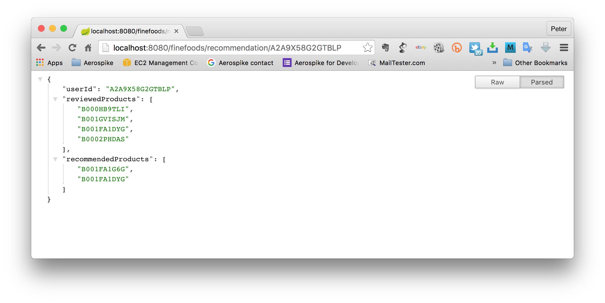

#Building a Recommendation Engine with OrientDB and Spring Boot 

Author: Peter Milne

**Recommendation engines** are used in applications to personalize the user experience. For example, e-commerce applications recommend products to a customer that other customers -  with similar behavior - have viewed, enjoyed, or purchased. News applications would use a real-time recommendation engine, as stories come and go quickly. These application additions improve the user experience, increase sales and help retain customer loyalty. This guide contains example code for a real-time, non-contextual, cosine-similarity based engine. 

This example uses the **Spring Boot** application environment, a powerful jump-start into the versatile Spring Java based web application framework. With Spring Boot you can build powerful applications with production grade services with little effort - and easily launch and enjoy the enclosed example. This example can be translated into other frameworks.


**OrientDB** is a Distributed Graph Database engine with the flexibility of a Document Database all in one product. (see [OrientDB](http://orientdb.com/))


##What you will build
This guide will take you through accessing the Github repository containing the project, and creating a simple recommendation service. The provided engine will use Similarity Vectors to recommend a product - in the case of the example data set, movies - to a customer. The algorithm for this is very elementary, and will provide a starting point for real-time recommendation research, but also will provide recommendations based on the demonstration data provided.

To provide a recommendation in real-time, you will need a database that can retrieve your data very quickly, as several database requests will be necessary to do the full recommendation. If your database is too slow, you will find - even over reasonable data sets - that the recommendation time is slow. 

You could try this with any database, in this exercise we will the OrientDB Graph/Document database. 

You will build a service that accepts an HTTP GET request:
```
http://localhost:8080/finefoods/recommendation/{userId}
```
for example
```
http://localhost:8080/finefoods/recommendation/A2A9X58G2GTBLP
```

It responds with the following JSON array of recommendations:
```json
{
	"userId": "A2A9X58G2GTBLP",
	"reviewedProducts": [
		"B000HB9TLI",
		"B001GVISJM",
		"B001FA1DYG",
		"B0002PHDAS"
	],
	"recommendedProducts": [
		"B001FA1G6G",
	]
}

```

If you’d like to just jump into trying out the code, skip forward to the “Setup the project” section.

There are also many features added to your application out-of-the-box for managing the service in a production (or other) environment. This functionality comes from Spring, see the Spring guide: [Building a RESTful web service](http://spring.io/guides/gs/rest-service).

##Recommendation Algorithm

This is a non-contextual behavioral recommendation engine. There are three categories of objects: Users and Reviews. 

In our provided example, users review products. Based on their reviews, other users determine whether they are interested in buying a product. Although our example uses this exact data set, it should be clear how to adapt this code to other data models.

A users’s profile will have a history of their reviews; and a product will have a history of who has rated it.

A simple recommendation task is to find another user who is similar to the target user and recommend products that the other user has enjoyed. It is a good idea to eliminate the duplicates so that the target user is only recommended products that they have not reviewed.

The data we are using in this exercise is a simulated data set which lists Movies watched by users, similar to data any media site like NetFlix, Hulu, or Tivo would use. In this simulation, there are only about 25 movies in the data set. The data is deliberately sparse to reduce the size, consequently data integrity is not guaranteed. There will be many more users and ratings than movies, and some movies have no ratings at all.

##Schema
OrientDB has a flexible NoSQL data model. You can choose to have a Schema, to be Schemaless or a mixture.  


###Review
A Review is an `Edge` that connects a User to a Product. It has a number of properties supplied by the person who revieded the product. The values in the map are:

Property | type 
---------|-----
productId | String
userId | String
profileName | String
helpfulness | String
score | Double
time | Integer
summary | String
text | String

###Products
The Product is a `Vertex` with a single property


Property | type
---------|-----
productId | String 

###users
The user record has a user ID and a List of movies watched and rated. It could contain additional attributes about the user, but for this example it simply contains a list of ratings.

user ID (primary key) | MOVIES_WATCHED
--------------------------|---------------
String | Large Stack of Ratings (Aerospike), List (MongoDB)


##How do you find similarity?
Similarity can be found using several algorithms, there are many academic papers available that describe the high order Mathematics on how to do this. In this example, you will use a very simple algorithm using [Cosine Similarity](https://en.wikipedia.org/wiki/Cosine_similarity) to produce a simple score.

###Scenario
1. Jane Doe accesses the application
2. Retrieve Jane’s User Profile
3. Retrieve the Review for each Product that Jane has reviewed. 
4. For each Product:
 - Retrieve each of the reviewed users
 - See if this user is similar to Jane’s by score their reviewes
5. Using the user profile with the highest similarity score, recommend the products in this user profile that Jane has not reviewed.

This is a **very elementary** technique and it is useful only as an illustration, and it does have several flaws. Here are a few:
 - Imagine that Jane has reviewed a product that millions of people have reviewed. It would be foolish to calculate similarity using the user profiles who viewed this product. If we generalize this idea, it would be that products with the number of reviews over a certain threshold should be excluded.
 - Cosine similarity assumes each element in the vector has the same weight and are in the same order. The elements in our vectors are the Edge Ids and corresponding ratings, but the sampe products may be reviewed at different times and in different orders, so a sorted vector would give a better score.

##What you will need
 - About 45 minutes
 - A favorite text editor or IDE
 - [JDK 7](http://www.google.com/url?q=http%3A%2F%2Fwww.oracle.com%2Ftechnetwork%2Fjava%2Fjavase%2Fdownloads%2Findex.html&sa=D&sntz=1&usg=AFQjCNGWCcKCIFm3bfDWtU41j6HJzekqNQ) or later
 - [Maven 2](http://maven.apache.org/download.cgi) or later 
 - An [OrientDB server](http://orientdb.com/download/) installation
 - The test data


##Setup the project
As this project is written in Java and using the Spring framework with OrientDB, you need Java and the OrientDB Java driver installed. We use [Maven](https://www.google.com/url?q=https%3A%2F%2Fmaven.apache.org%2F&sa=D&sntz=1&usg=AFQjCNEeDpKe4dgXLJx95yPQ8bGMJ9HR-A) to build the project, which also must be installed. If you are unfamiliar with Maven refer to the Spring guide: [Building Java Projects with Maven](http://spring.io/guides/gs/maven).
###Step 1: Install Maven and OrientDB

Follow the instructions to [Install Maven](http://maven.apache.org/guides/getting-started/maven-in-five-minutes.html) your development machine.

The OrientDB dependencies will be installed on your local machine as part of the Maven build. 

OrientDB is dead easy to install, just unzip the downloaded ZIP/tgz and you are ready to run the server.

There are som very easy to follow videos at [getting started](http://orientdb.com/getting-started/) 

###Step 2: Clone the project git repository

All the source code for this example is a GitHub [here](https://github.com/helipilot50/orientdb-recommendation.git). To clone the repository to your development machine, enter the following command:
```bash
git clone https://github.com/helipilot50/orientdb-recommendation.git
```

###Step 3: Build with maven

The Maven pom.xml will package the service into a single jar. Use the command:
```bash
mvn clean package
```
Maven will download all the dependencies (Spring Boot, Commons CLI, Log4j, Simple JSON) and install them in your local Maven repository. Then it will build and package the application as a stand-alone runnable jar with a web service application including an instance of Tomcat, so you can simply run the jar without installing it in an Application Server.

###Step 4: Load Data
A data uploader, included in the JAR that will upload \Product reviews to OrientDB. The test data is included in the directory `data`. Each file contains 50,000 Reviews. To load the data, run the JAR with the following options:
```bash
java -cp helipilot50-orientdb-recommendation-0.0.1-SNAPSHOT.jar helipilot50.orientdb.recommendation.dataimport.DataLoad
```

###Step 6: Running the Service

At the command prompt, enter the following command to run the packaged application. This application will open the REST service at port 8080.
```bash
java -jar helipilot50-orientdb-recommendation-0.0.1-SNAPSHOT.jar
```

Then, in a browser, enter the URL:
```
http://localhost:8080/finefoods/recommendation/A2A9X58G2GTBLP
```


The result should be like this:



Note: I'm using Crome as my browser with an Extension that formats JSON documents nicely. You can find it [here](https://github.com/callumlocke/json-formatter)

##Code discussion

The method that find similarity are deliberately linear, and avoid complex framework methods and hierarchies. This enables the reader can clearly see all the parts of the algorithm without details being obfuscated buy frameworks.
  
###RESTful service
The most interesting part of the code is the method: `getRecommendationFor()` in the class RESTController.
```java
@RequestMapping(value="/finefoods/recommendation/{userId}", method=RequestMethod.GET)
	public @ResponseBody Recommendation getRecommendationFor(@PathVariable("userId") String userId) throws Exception {	
. . . 
}
```

This method processes a REST request and responds with a JSON object that contains the user ID, a list of products the user has reviewed and recommended products.

The user ID supplied in the REST request is used as the key to retrieve the user Vertex.
```java
Vertex vUser = service.findUserById(userId);
```
The actual work of finding the user is done by the `FineFoodService` class.
```java
public Vertex findUserById(String userId){
	Vertex vUser = null;
	Iterable<Vertex> users = graph.getVertices(Constants.USER_ID, userId);
	if (users.iterator().hasNext()) {
		vUser = users.iterator().next();
	} else {
		throw new UserNotFound(userId);
	}
	return vUser;
}
```
Once we have the user `Vertex`, we get a list of Reviews that they have made, this is a list of `Edges`. We also construct a `Recommendation` object, populate it with the User ID and Reviews, and make a Vector from the Review `Edges`.
```java
List<Double> thisUserReviewVector = service.makeVectorForUser(vUser);

Recommendation rec = new Recommendation(userId, productListAsString(service.productsForUser(vUser)));

```
This vector is simply a list of Doubles. We will use this vector in our similarity comparisons.

We then iterate through the Reviews that the User has made and corresponding Products, and build a list of Users that have reviewed these products, then find the most similar customer using Cosine Similarity:
```java
/*
 * for each Review from this User, iterate
 * through the other User that also reviewed
 * the food 
 */
List<Vertex> otherUsers = service.similarUsers(vUser);
for (Vertex similarUser : otherUsers){
	if (!similarUser.equals(userId)) {
		// find user with the highest similarity

		List<Double> similarUserVector = service.makeVectorForUser(similarUser);

		double score = easySimilarity(thisUserReviewVector, similarUserVector);

		if (score > bestScore){

			bestScore = score;
			bestMatchedUser = similarUser;
			bestMatchedList = service.productsForUser(similarUser);
		}
	}
}
log.debug("Best customer: " + bestMatchedUser);
log.debug("Best score: " + bestScore);
```
Having completed iterating through the list of similar users you will have the user with the highest similarity score. We then get the products that this customer has watched 
```java
// return the best matched user's purchases as the recommendation
		Set<String> recommendedProducts = productListAsString(bestMatchedList);
```
and place the list into the Recommendation object we created earlier. Finally we return the Recommendation and Spring translates it into JSON 
```java
rec.setRecommendedProducts(recommendedProducts);
return rec;
```

##Summary
Congratulations! You have just developed a simple recommendation engine, housed in a RESTful service using Spring and OrientDB. 

